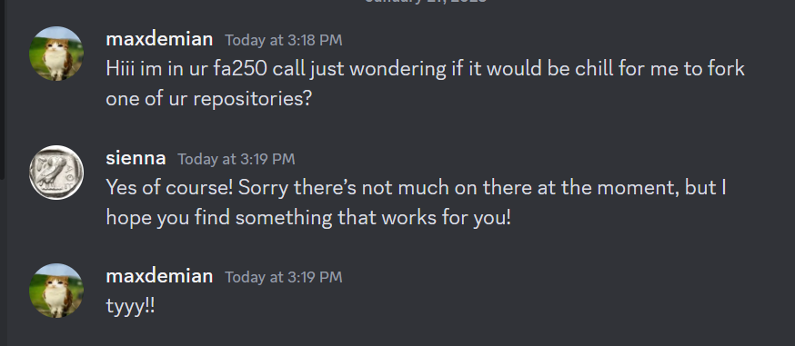
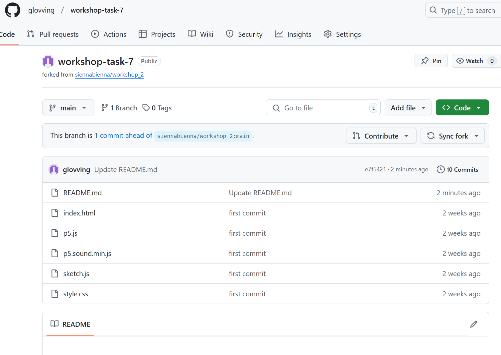
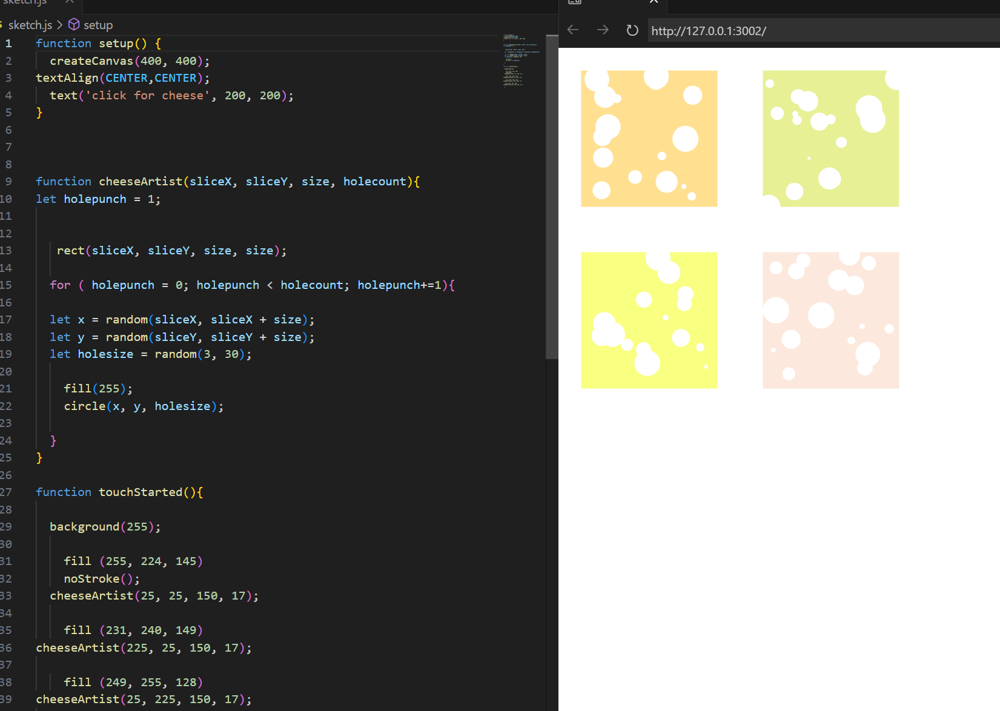
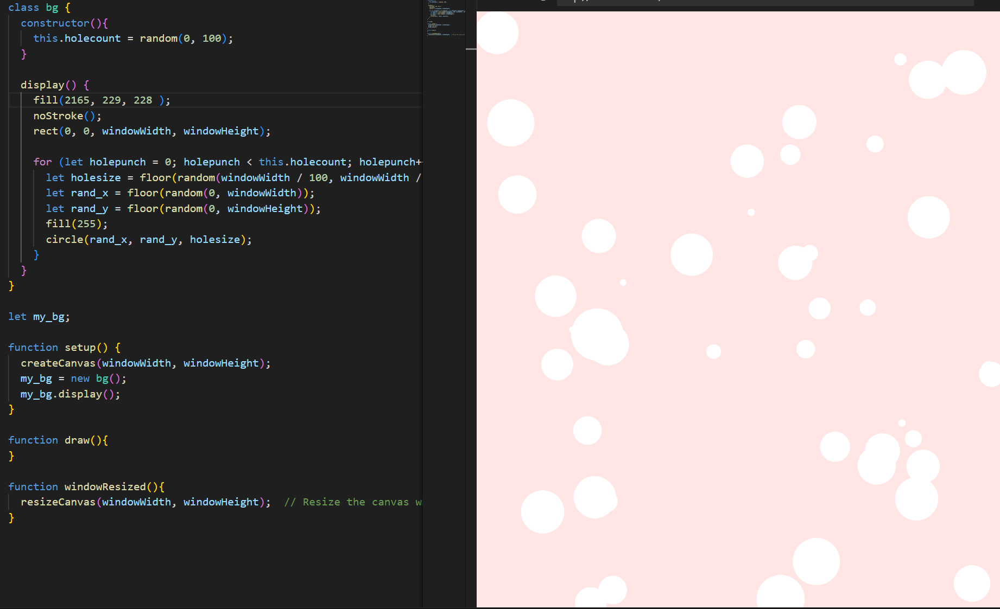
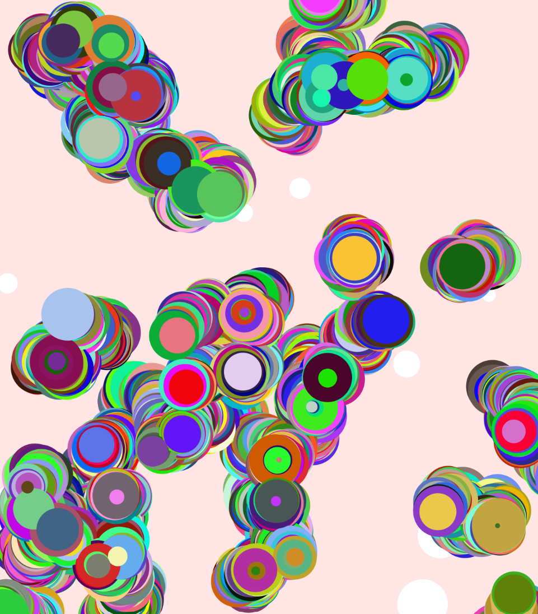
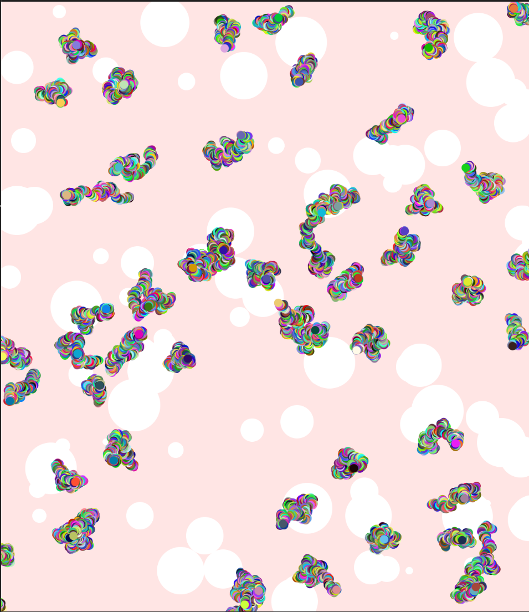
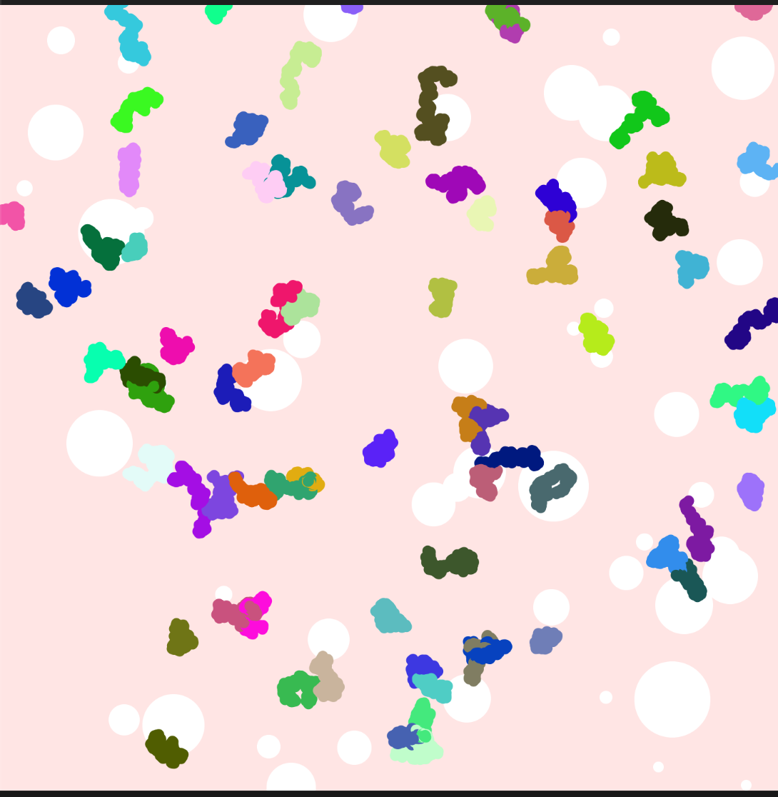
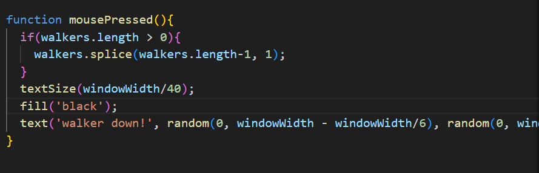
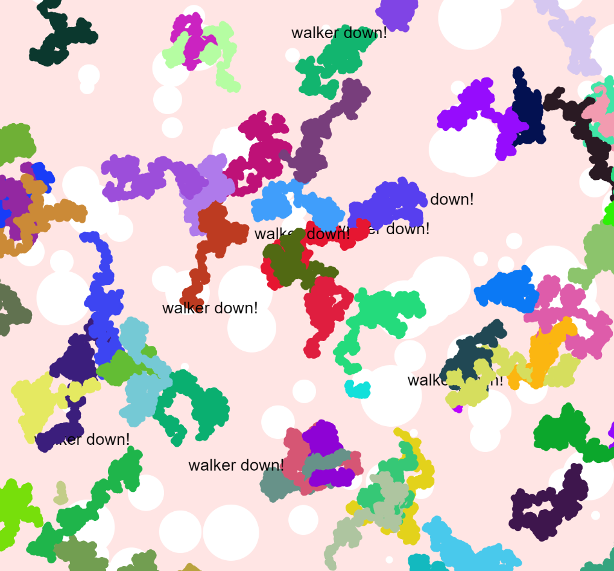

# Workshop task 7
For this workshop I have forked Siennas workshop 2 repository, here is a link to the original page -> (https://github.com/siennabienna/workshop_2)

Link to my completed website -> (https://glovving.github.io/workshop-task-7/)
# Objects and Simulation 

## Goals for this workshop:
- Build a simulation of a real or imagined entity or environment.
- Experiment with random walks and/or particle systems in your sketch.
- Make a new repository for your p5.js project on your GitHub account, publish your sketch as a webpage, and include a README file in your repository with a URL to the webpage along with documentation of your work.

## Notes and Planning
Here are some notes I took during the demonstration (left), and my initial sketch for what I wanted my website to look like(right):

My plan was to fork a classmates repository, and create a background image with pieces of their code that I would modify to meet my needs.
Then I would have my walkers on top of that background + one more extra functionality.

## Forking Repository
I asked one of my classmates - Sienna if I could use fork one of their repositories.

Once I got permission, I forked their workshop task 2 repository into my workshop task 7 repository, I then downloaded that repository and opened it in vscode to work on.

After this I read through the code to figure out how it worked, then I created a new bg class object, copying over, then editing fragments of code I wanted to use.

My new bg class object ^
I wrote my bg class to be adaptable to and window size, so I used the windowWidth and windowHeight of the canvas as references for the x and y points and limits for circle generation, rather than the set points in Siennas original sketch which had a set canvas size.

## Walker Function
I began writing my walker function using Leo's example as a heavy reference.
My first iteration of the walkers had a random size generator for the size of the walker, however I decide to get rid of this because it didn't look very good.

As you can see in the picture above, the result was pretty interesting.
I had a look at a smaller size (below) and it was closer to how I wanted the end result to be, so I changed the default size of the walkers to be 1/100th of the canvas width.

After that I also edited my walker class to have one randomly generated colour per instance of class object rather than generate a new colour each frame.
In the image below I have shown how my random rgb value generation used to be within the show() function of the walker rather than the constructor.

At this point my walkers were appearing and moving as I wanted them to (below)

## Stopping Walkers
For my added functionality I decided to give the user the ability to stop the walkers, I did this by writing a mousePressed() function where upon clicking the screen a walker would be deleted from the walkers array, this would stop the walker from moving any further but leave the previous 'footsteps' behind. 

I also added a text that would appear on screen each time the user 'kills' a walker.

Above is a an example of what the website looks like.

